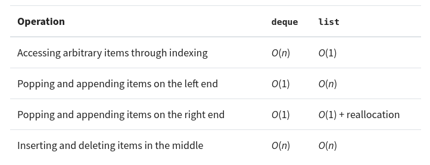

# Dequeue

The name stands for **d**ouble-**e**nded **que**ue.

`deque` is implemented as a **doubly linked list**. Which is why appending and popping from both ends take **O(1)** whereas in list it takes O(n) to do these operations due to reallocation of memory.



* Operations for left: **popleft()** and **appendleft(item)**
* Operations for right: **pop()** and **append(item)**&#x20;

```python
from collections import deque

numbers = deque([1, 2, 3, 4])

# left side
numbers.popleft() # 1
numbers.appendleft(2) # [2, 2, 3, 4]

# right side
numsers.pop() # 4
numbers.append(5) # [2, 2, 3, 5] 
```

### Resources

Implemenation:

* How to implement: [https://realpython.com/python-deque/](https://realpython.com/python-deque/)
